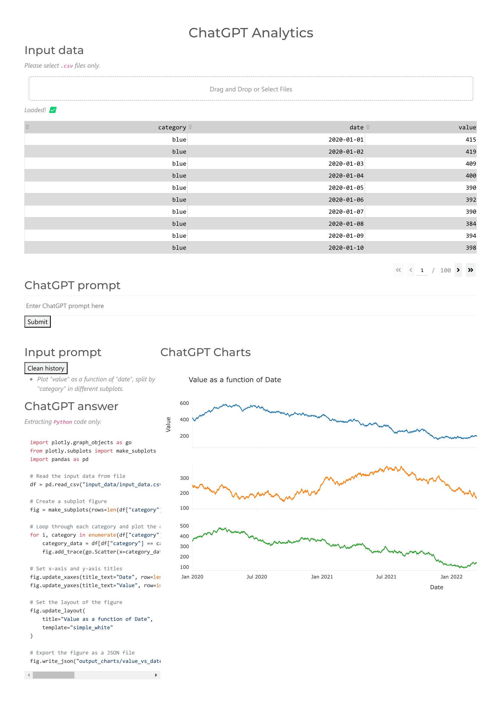

# `chatgpt-analytics`: automate analytics with ChatGPT 

## Installation
- Clone the repository.
- Create a ChatGPT account and an API key.
- Add a text file `API_KEY.txt` in the root folder with your ChatGPT API key.
- Run the `dashboard.py` file and open local host `http://127.0.0.1:8050` to access the dashboard.

## Project structure
- `chatgpt_analytics.py`: python file with alll functions to tinteract with ChatGPT.
- `dashboard.py`: python file for interactive dahsboard and visualizations.
- `input_data/`: folder where the loaded input data will be stored.
- `input_prompt/`: history of prompt entered in the session.
- `output_charts/`: plotly charts as `.json` files exported from the chatgpt answer.
- `output_chatgpt/`: `.json` files of the history of chatgpt answers and last one.
- `prompt_context.txt`: Context prompt file for ChatGPT.

## Using the dshboard
- Load `.csv` data using drag and drop, or click `Select files` to select files in folder.
- Enter prompt describing the chart you want to have from the input data, and click `Submit` to generate the chart.
- The code to generate the chart will be seen in the `ChatGPT answer` section.
- Refine demande by adding new prompts, the history of demand being seen under the submit button.
- Click `Clean history` in order to reset context for ChatGPT.